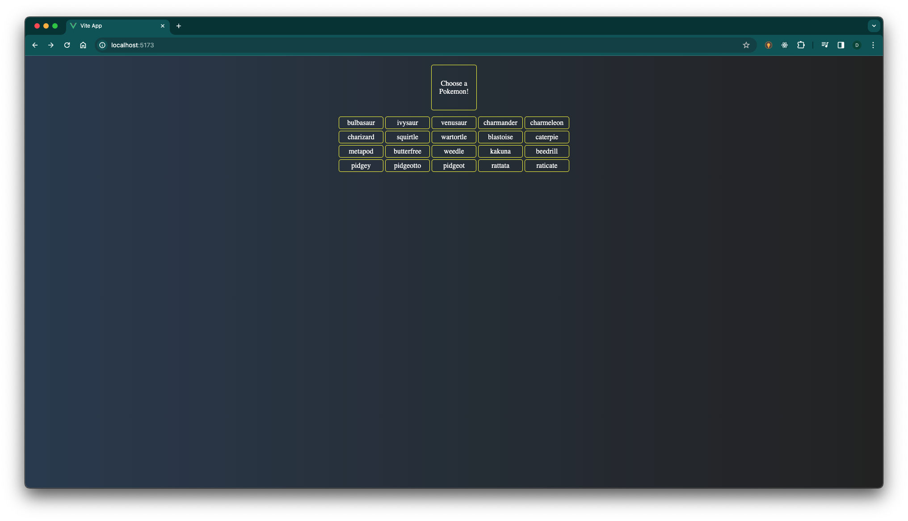
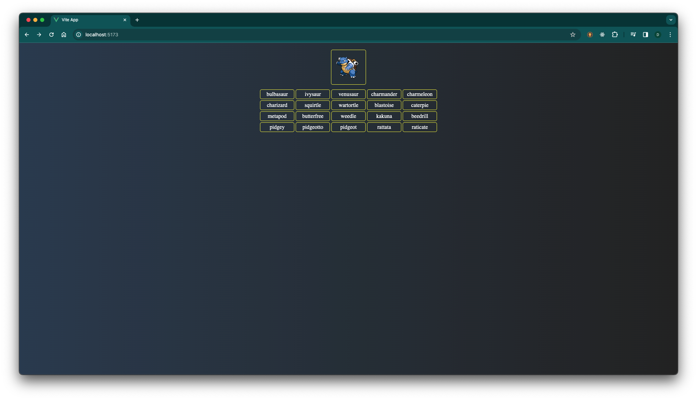
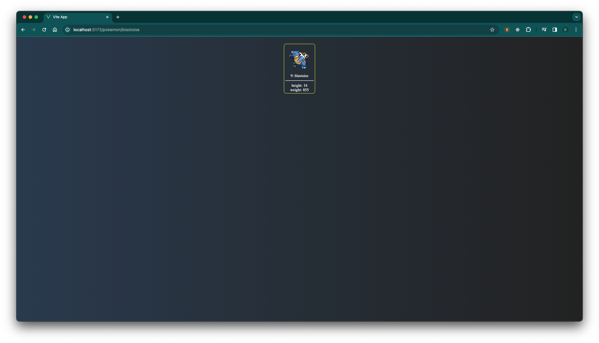

# Pokedex-vue
Project created to test some Vue cool stuff like:
- fetching data from an API.
- using vue router to navigate.

## Project Setup

```sh
git clone https://github.com/Dea10/pokedex-vue.git
cd pokedex-vue
npm install
```

### Compile and Hot-Reload for Development

```sh
npm run dev
```

## Some screenshots



